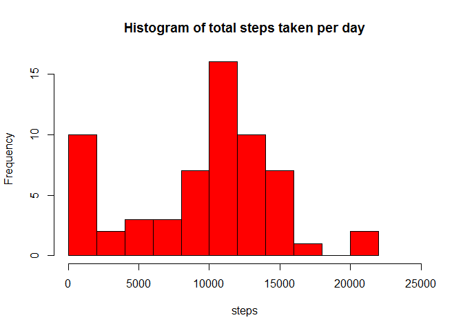
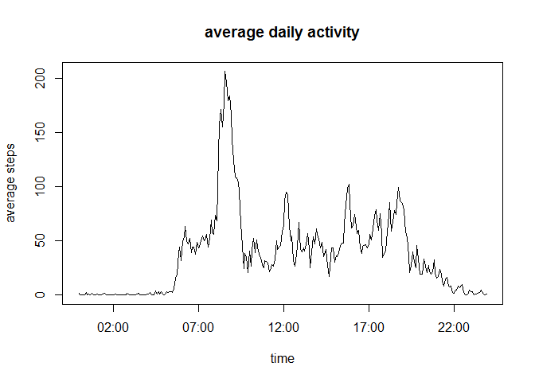
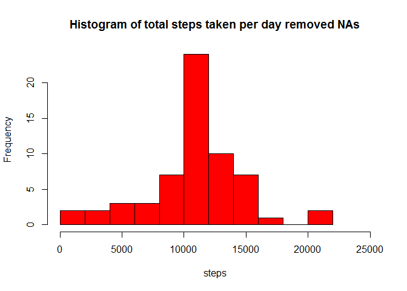
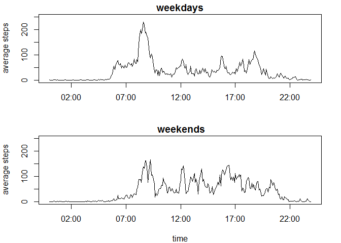

# Reproducible Research: Peer Assessment 1
## Loading and preprocessing the data

We start by loading the data of the file activity.csv. 

```r
data<-read.csv('activity.csv')
```

## What is mean total number of steps taken per day?

In the following we create a vector called day_steps that computes for each day the total amount of steps taken. We do that by first identifying all the days and then via a loop summing the steps over all intervals for the respective day. Note that we ignore all the missing values in the dataset by adding na.rm=TRUE in the sum function.

```r
days<-unique(data$date)
a<-length(days)
day_steps<-NULL
for(i in 1:a){
        day_steps<-c(day_steps,  sum(data[data$date==days[i],]$steps, na.rm=TRUE) )
}
day_steps[1:10]
```

```
##  [1]     0   126 11352 12116 13294 15420 11015     0 12811  9900
```
Above we display for the first 10 days the total amount of steps taken by the individual. First let us again produce a data.frame that gives for each interval the average 


Below we display the histogram of total steps taken per day, where we choose breaks=10 in order to minimize the binsize, which is chosen by the default setting.

```r
hist(day_steps, main='Histogram of total steps taken per day', xlab='steps', breaks=10, xlim=c(0,25000), col='red')
```

 

In the following we compute the mean and median of the number of steps taken per day by the individual via the R-code

```r
mean(day_steps)
```

```
## [1] 9354.23
```

```r
median(day_steps)
```

```
## [1] 10395
```
which compute to 9354.23 and 10395 for the mean and the median, respectively. 


## What is the average daily activity pattern?


In the following we create a data.frame called act_steps that gives for each interval the mean (over the different days) of steps taken. We do that by first identifying all the intervals and then via a loop computing the average steps over all days for the respective interval. Note that we ignore all the missing values in the dataset by adding na.rm=TRUE in the mean function.


```r
intervals<-unique(data$interval)
a<-length(intervals)
act_steps<-NULL
for(i in 1:a){
        act_steps<-rbind(act_steps,  c(intervals[i], mean(data[data$interval==intervals[i],]$steps, na.rm=TRUE) ))
}
act_steps<-as.data.frame(act_steps, stringsAsFactors=FALSE)
colnames(act_steps)<-c('interval', 'average_steps')
head(act_steps)
```

```
##   interval average_steps
## 1        0     1.7169811
## 2        5     0.3396226
## 3       10     0.1320755
## 4       15     0.1509434
## 5       20     0.0754717
## 6       25     2.0943396
```
Now we have a data.frame displaying for each interval the steps taken by the individual averaged over the 61 days. However in order to make a time series plot we also have to transform the interval entries into proper time variables. This is done by the code

```r
act_steps_new<-act_steps
act_steps_new$interval<-as.POSIXct(sprintf("%02d:%02d", act_steps_new$interval%/%100,act_steps_new$interval%%100), format='%H:%M')
```
Note that we called the data.frame differently, namely , since we will use the data.frame act_steps later on.
The last steps of the above code serve to trannsform the interval variable into a proper time variable that allows to make a time series plot. The actual plot will be generated via the code below.

```r
plot(act_steps_new$interval, act_steps_new$average_steps, type='l',ylab='average steps', xlab='time', main='average daily activity')
```

 

From the plot we see that the highest average activity is between 8:00  and 10:00. Let us now determine the exact interval, where the individual shows on average the most activity.  


```r
substr(act_steps[act_steps$average_steps==max(act_steps$average_steps),][,1],12,19) 
```

```
## [1] ""
```

```r
  act_steps[act_steps$average_steps==max(act_steps$average_steps),][,2]
```

```
## [1] 206.1698
```
We find that on average the most activity appears at 8:35, with around 206 steps.

## Imputing missing values

Let us frist determine the number of missing values in the dataset. 

```r
length(data[data$steps=='NA',][]$steps)
```

```
## [1] 2304
```
Thus we have 2303 missing values in our dataset. 

We will fill those missing data by replacing them by the mean for that 5 minute interval given by the other days. 
For this we will use the data.frame act_steps generated in the previous section. The corresponding code reads


```r
new_data<-data
a<-length(data$steps)
for(i in 1:a){
        if(is.na(new_data$steps[i])==TRUE ){
                new_data[i,1]<- act_steps[act_steps$interval==new_data[i,3],][,2]
        }
}
```
Let us compare now the old data set with missing values with the new one where we replaced the missing values by the average steps taken in this interval on the other days. Firt let us display the first 6 lines of the old and new dataset


```r
head(data)
```

```
##   steps       date interval
## 1    NA 2012-10-01        0
## 2    NA 2012-10-01        5
## 3    NA 2012-10-01       10
## 4    NA 2012-10-01       15
## 5    NA 2012-10-01       20
## 6    NA 2012-10-01       25
```

```r
head(new_data)
```

```
##       steps       date interval
## 1 1.7169811 2012-10-01        0
## 2 0.3396226 2012-10-01        5
## 3 0.1320755 2012-10-01       10
## 4 0.1509434 2012-10-01       15
## 5 0.0754717 2012-10-01       20
## 6 2.0943396 2012-10-01       25
```

We see that the NA's apperaing in the old dataset are replaced by the values computed earlier (see the first 6 lines of act_steps above)

In the following we will generate an histogram of the same type, however now using the new dataset new_data. We will use the same code as above, but replacing data by new_data
 

```r
days<-unique(data$date)
a<-length(days)
new_day_steps<-NULL
for(i in 1:a){
        new_day_steps<-c(new_day_steps,  sum(new_data[new_data$date==days[i],]$steps) )
}
new_day_steps[1:10]
```

```
##  [1] 10766.19   126.00 11352.00 12116.00 13294.00 15420.00 11015.00
##  [8] 10766.19 12811.00  9900.00
```
Clearly we already see a significant difference in the output of total steps per day compared to the old dataset where we set missing values basically to 0. The histogram empasizes this fact even more

```r
hist(new_day_steps, main='Histogram of total steps taken per day removed NAs', xlab='steps', breaks=10, xlim=c(0,25000), col='red')
```

 

The peak at 0 of the old histogram, which was mainly due to the reason that various days had a significant amount of NA's in their dataset, is now gone. On the other hand the peak at the center is significantly larger, due to the fact that we used as replacing method an average scheme.

Let us as before calculate the mean and median of the total number of steps taken by the individual

```r
#options(digits=22)
mean(new_day_steps)
```

```
## [1] 10766.19
```

```r
median(new_day_steps)
```

```
## [1] 10766.19
```
In contrast to before the mean and meadian take the same value. As expected both values are larger than the ones determined for the old dataset containing missing values.

## Are there differences in activity patterns between weekdays and weekends?
Let us first add a new column to the data, indicating whether the day is a weekday or a weekend day.


```r
weekdays<-c('Monday','Tuesday', 'Wednesday', 'Thursday','Friday')
weekend<-c('Saturday','Sunday')
a<-length(data$steps)
day=NULL
for(i in 1:a){
        if(weekdays(as.POSIXct(data[i,2], format='%Y-%m-%d')) %in% weekdays)
                {
                day <- c(day, 'weekday')
        }
        else if (weekdays(as.POSIXct(data[i,2], format='%Y-%m-%d')) %in% weekend)
                 {
                day<- c(day, 'weekend')
        }
}
new_data_week<-cbind(new_data, day)
head(new_data_week)
```

```
##       steps       date interval     day
## 1 1.7169811 2012-10-01        0 weekday
## 2 0.3396226 2012-10-01        5 weekday
## 3 0.1320755 2012-10-01       10 weekday
## 4 0.1509434 2012-10-01       15 weekday
## 5 0.0754717 2012-10-01       20 weekday
## 6 2.0943396 2012-10-01       25 weekday
```

This can be done by the code above. Note that we printed the first 6 lines of the new data.frame new_data_week.
In the follwing we will subset this data.frame into two data.frames, one recording the activity on weekdays the other one recording the activity at weekends. 


```r
new_data_weekdays<-subset(new_data_week, new_data_week$day=='weekday' )
#length(new_data_weekdays$day)
new_data_weekend<-subset(new_data_week, new_data_week$day=='weekend' )
#length(new_data_weekend$day)
```

Given those two data.frames we perform the same analysis as for the 2nd task. We start with the weekdays dataset


```r
intervals<-unique(new_data_weekdays$interval)
a<-length(intervals)
act_steps_weekday<-NULL
for(i in 1:a){
        act_steps_weekday<-rbind(act_steps_weekday,  c(intervals[i], mean(new_data_weekdays[new_data_weekdays$interval==intervals[i],]$steps) ))
}
act_steps_weekday<-as.data.frame(act_steps_weekday, stringsAsFactors=FALSE)
colnames(act_steps_weekday)<-c('interval', 'average_steps')
act_steps_weekday$interval<-as.POSIXct(sprintf("%02d:%02d", act_steps_weekday$interval%/%100,act_steps_weekday$interval%%100), format='%H:%M')
```

Here we transfromed the interval entries in proper time entries such that we able to make a time series plot. 

In an analogous fashion we generate a data.frame for the average activity for the respective time intervals for the weekends.  

```r
intervals<-unique(new_data_weekend$interval)
a<-length(intervals)
act_steps_weekend<-NULL
for(i in 1:a){
        act_steps_weekend<-rbind(act_steps_weekend,  c(intervals[i], mean(new_data_weekend[new_data_weekend$interval==intervals[i],]$steps) ))
}
act_steps_weekend<-as.data.frame(act_steps_weekend, stringsAsFactors=FALSE)
colnames(act_steps_weekend)<-c('interval', 'average_steps')
act_steps_weekend$interval<-as.POSIXct(sprintf("%02d:%02d", act_steps_weekend$interval%/%100,act_steps_weekend$interval%%100), format='%H:%M')
```

Now we can make a panel plot of the time series plot of the 5 minute interval and the average steps  taken by the individual for weekdays or weekends. This polt is generated by the R-code

```r
par(mfrow=c(2,1), mar=c(4,4,1.5,2))
plot(act_steps_weekday$interval, act_steps_weekday$average_steps, type='l',ylab='average steps', xlab='' , ylim=c(0,250) , main='weekdays')
plot(act_steps_weekend$interval, act_steps_weekend$average_steps, type='l',ylab='average steps', xlab='time' , ylim=c(0,250),main=' weekends')
```

 

As expected the individual shows far more activity early in the morning on weekdays compared to weekends, however less activity around noon and afternoon. This most likely can be explained by the working habits during the weekdays as well as the habits of the individual at weekends.
